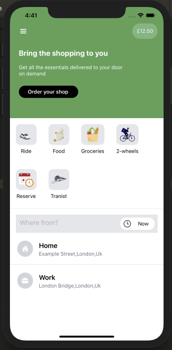

# Uber App Clone

An Uber app clone using expo , react native with Redux and tailwindcss, Google cloud services are also used for map and directions


## Author

- [@Sohail Gsais](https://www.github.com/SohailMG)


## Techs Used
- [Expo](https://expo.dev/)
- React Native 
- Tailwindcss
- [Google Cloud Services](https://cloud.google.com/)
    - Places API
    - Directions API
    - Distance Matrix API
- Redux


## Demo

Soon...


## Screenshots




## Lessons Learned

- Using React Native with Redux
- Combining tailwindcss with styled-components
- Using Google Cloud Services


## Installation

- Clone this Repo
- Install the [Expo Go](https://apps.apple.com/gb/app/expo-go/id982107779) IOS or [Expo Go](https://play.google.com/store/apps/details?id=host.exp.exponent&hl=en_GB&gl=US) Android
- Install the [expo-cli](https://docs.expo.dev/) tools

```bash
  cd uber-clone && npm install
```
```bash
  expo start
```
- Scan the QR code from the webpage and it should open the Expo Go app


## Feedback

If you have any feedback, please reach out at gsais.sohail9@gmail.com


## Features

- Google maps autocomplete places search
- Distance matrix measurement
- Ride price and surge


